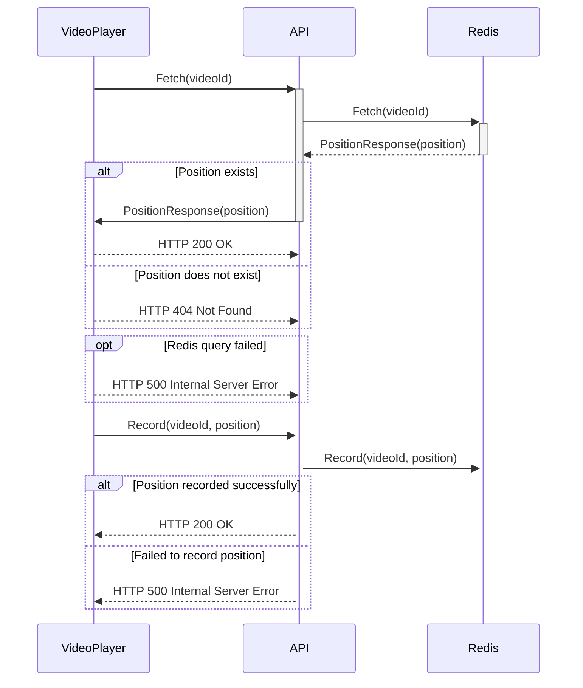

# Continue Watching API

```mermaid
sequenceDiagram
    participant VideoPlayer
    participant API
    participant Redis

    VideoPlayer->>+API: Fetch(videoId)
    API->>+Redis: Fetch(videoId)
    Redis-->>-API: PositionResponse(position)
    alt Position exists
        API->>-VideoPlayer: PositionResponse(position)
        VideoPlayer-->>API: HTTP 200 OK
    else Position does not exist
        VideoPlayer-->>API: HTTP 404 Not Found
    end
    opt Redis query failed
        VideoPlayer-->>API: HTTP 500 Internal Server Error
    end

    VideoPlayer->>+API: Record(videoId, position)
    API->>+Redis: Record(videoId, position)
    alt Position recorded successfully
        API-->>VideoPlayer: HTTP 200 OK
    else Failed to record position
        API-->>VideoPlayer: HTTP 500 Internal Server Error
    end
```
