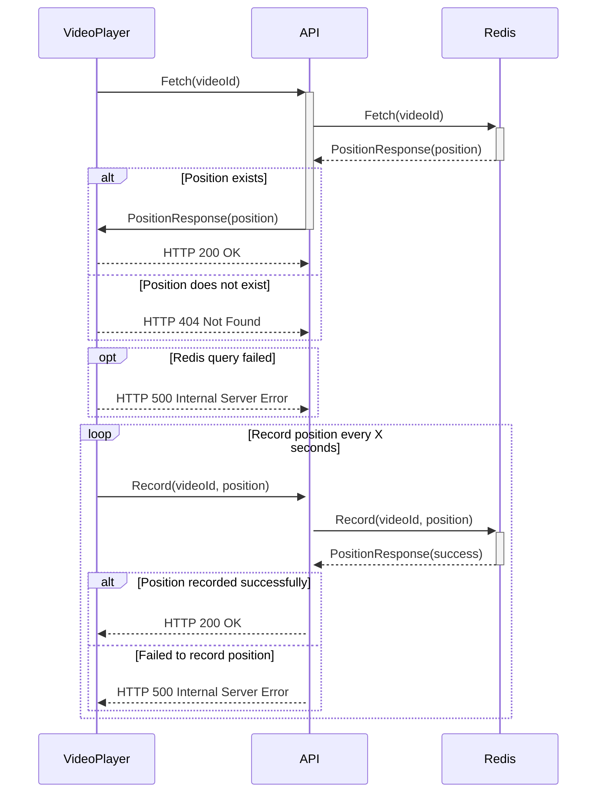

# Continue Watching API

Do you enjoy watching videos on demand platforms like YouTube, HBO, Prime Video, or Globoplay? If so, you may have noticed a convenient feature called "Continue Watching." This feature saves you from the hassle of remembering where you left off in a video.

In this project, we aim to develop a video player application that incorporates the "Continue Watching" functionality. The video player will interact with an API to store and retrieve the current position being watched in a video.

Once you start watching a video, the video player will periodically make requests to the API to record the current position. This ensures that even if you leave the video and come back later, the player will resume playback from the exact moment you last watched.

The API will be responsible for handling the requests from the video player and storing the positions in a reliable data store, such as Redis. When requested, the API will retrieve the last known position for a specific video and provide it to the video player, enabling seamless playback from where you left off.

Here is a sequence diagram to help you visualize how the information flows:

## Demo

To experience the "Continue Watching" feature in action, we provide a demo page that allows you to experiment with the functionality firsthand.

Before running the project, make sure you have the following tools installed:

* Go
* Redis

This project utilizes a development environment tool called _devbox_, which simplifies the setup process. It provides a pre-configured environment, including Redis, to ensure a smooth experience.

To start the project, follow these steps:

1. Launch the `devbox shell` by running the appropriate command.
2. Within the _devbox shell_, execute `go run main.go` to start the server. This will also expose the index page containing the video player.

Once the server is running, you can begin testing the "Continue Watching" feature:

1. Start playing the video and watch it for at least 30 seconds. Close this tab.
2. Open a private browser tab or window.
3. Navigate to the index page again in the private tab or window.
4. The video will resume playback from a position as close as possible to where you left off, allowing you to seamlessly continue watching.

By following these steps, you can observe how the project effectively stores and retrieves the last watched position, providing a convenient viewing experience for users. Feel free to explore different scenarios, pause the video, seek to the future to fully grasp the capabilities of the "Continue Watching" feature.
