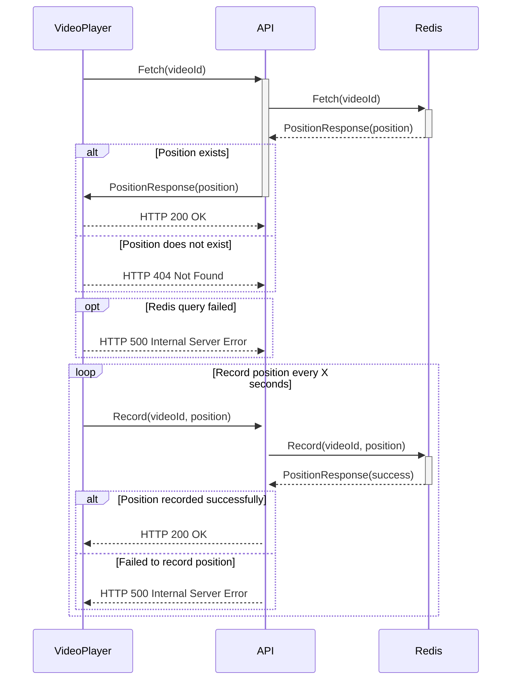

# Continue Watching API

Do you enjoy watching videos on demand platforms like YouTube, HBO, Prime Video, or Globoplay? If so, you may have noticed a convenient feature called "Continue Watching." This feature saves you from the hassle of remembering where you left off in a video.

In this project, we aim to develop a video player application that incorporates the "Continue Watching" functionality. The video player will interact with an API to store and retrieve the current position being watched in a video.

Once you start watching a video, the video player will periodically make requests to the API to record the current position. This ensures that even if you leave the video and come back later, the player will resume playback from the exact moment you last watched.

The API will be responsible for handling the requests from the video player and storing the positions in a reliable data store, such as Redis. When requested, the API will retrieve the last known position for a specific video and provide it to the video player, enabling seamless playback from where you left off.

Here is a sequence diagram to help you visualize how the information flows:

